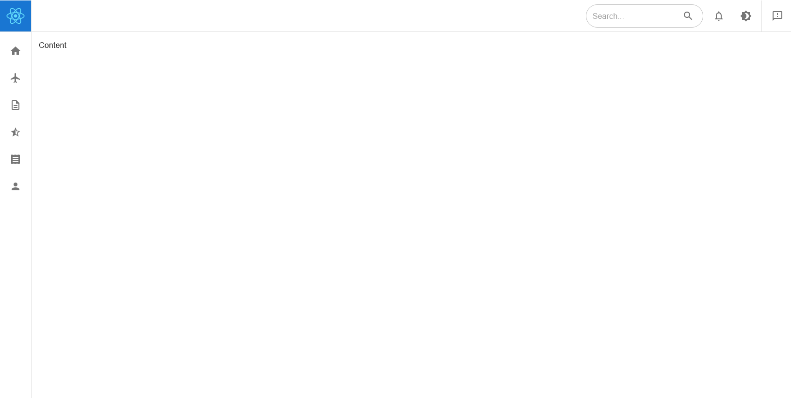

<!--
*** Thanks for checking out the Best-README-Template. If you have a suggestion
*** that would make this better, please fork the repo and create a pull request
*** or simply open an issue with the tag "enhancement".
*** Thanks again! Now go create something AMAZING! :D
*** https://github.com/othneildrew/Best-README-Template/blob/master/README.md
-->

<!-- PROJECT SHIELDS -->
<!--
*** I'm using markdown "reference style" links for readability.
*** Reference links are enclosed in brackets [ ] instead of parentheses ( ).
*** See the bottom of this document for the declaration of the reference variables
*** for contributors-url, forks-url, etc. This is an optional, concise syntax you may use.
*** https://www.markdownguide.org/basic-syntax/#reference-style-links
-->

<br />
<p align="center">
  <a href="https://github.com/othneildrew/Best-README-Template">
    
  </a>

  <h3 align="center">[TODO] Project Name</h3>

  <p align="center">
    [TODO] Project Description
    <br />
    <a href="https://example.com">[TODO] View Demo</a>
    ·
    <a href="https://gitlab.com/03-03/rb-playground/-/issues">[TODO] Report Bug</a>
    ·
    <a href="https://gitlab.com/03-03/rb-playground/-/issues">[TODO] Request Feature</a>
  </p>
</p>

<details open="open">
  <summary>Table of Contents</summary>
  <ol>
    <li>
      <a href="#about-the-project">About The Project</a>
      <ul>
        <li><a href="#built-with">Built With</a></li>
      </ul>
    </li>
    <li>
      <a href="#getting-started">Getting Started</a>
      <ul>
        <li><a href="#prerequisites">Prerequisites</a></li>
        <li><a href="#installation">Installation</a></li>
      </ul>
    </li>
    <li><a href="#usage">Usage</a></li>
    <li>
      <a href="#developer-info">Developer Info</a>
      <ul>
        <li><a href="#things-to-take-note">Things to take note</a></li>
        <li><a href="#folder-structure">Folder Structure</a></li>
        <li><a href="#testing">Testing</a></li>
        <li><a href="#testing">Utilities</a></li>
      </ul>
    </li>
    <li><a href="#changelog">Changelog</a></li>
  </ol>
</details>

## About The Project

[TODO] replace with actual project home screenshot


[TODO] descriptive tagline and what this project does

### Built With

- [React Boilerplate CRA Template](https://cansahin.gitbook.io/react-boilerplate-cra-template/) - The CRA template used
  - Upgrade to [React 17](https://reactjs.org/blog/2020/10/20/react-v17.html)
  - Change [styled-components](https://styled-components.com/) to [Emotion 11](https://emotion.sh/docs/introduction)
  - Comes with [Redux](https://redux.js.org/), [Redux Saga](https://redux-saga.js.org/) and [Redux Injectors](https://github.com/react-boilerplate/redux-injectors)
- [MUI 5](https://material-ui.com/versions/) - UI framework [TODO: update to active on/after 1st Sep 2021]
- [Storybook 6.3](https://storybook.js.org/releases/6.3) - Tool for UI development, testing and documentation
- [CRACO](https://github.com/gsoft-inc/craco) - Configuration Layer
  - [craco-alias](https://www.npmjs.com/package/craco-alias) - automatic aliases generation for webpack and jest
- [ESLint](https://eslint.org/) - Typescript/Javascript Code Analysis Tool
  - [eslint-config-airbnb-typescript-prettier](https://github.com/toshi-toma/eslint-config-airbnb-typescript-prettier) - Airbnb's ESLint config with TypeScript and Prettier support.
- [stylelint](https://stylelint.io/) - CSS Code Analysis Tool
- [Prettier](https://prettier.io/) - Code Formatter
- [Husky](https://typicode.github.io/husky) - Pre-commit Hooks
  - [Lint-staged](https://github.com/okonet/lint-staged) - Run linters against staged files
- [React Testing Library](https://testing-library.com/docs/react-testing-library/intro) - light-weight solution for testing React components

## Getting Started

This section provide instructions to set up this project locally, get it up and running.

### Prerequisites

To get the project running locally, you will need to have the following setup/installed first.

- Node.js

  Get a copy of the installer [here](https://nodejs.org/en/download/) and install locally.

  **Note:**

  > This project requires Node 16.
  > <br/>

  Alternatively, if you are working in the internet space, you may use Node Version Manager (nvm) to get a copy of any node of a specific version through CLI.

  For Windows OS, an example of Node Version Manager will be [nvm-windows](https://github.com/coreybutler/nvm-windows). Get a copy of the installer [here](https://github.com/coreybutler/nvm-windows/releases) and install locally.

  After installing, `nvm`, you may run the folllowing CLI to

  - Download the current latest stable version.

    ```sh
    nvm install latest
    ```

  - Download a specific version. [TODO: update to a 16 LTS version, on/after 26th Oct 2021]

    ```sh
    nvm install 16.4.2
    ```

  - Use a downloaded node.js [TODO: update to a 16 LTS version, on/after 26th Oct 2021]

    ```sh
    nvm use 16.4.2
    ```

  - View a list of installed node.js and which is currently in use

    ```sh
    nvm list
    ```

- Yarn 1

  This project is build on top of [React Boilerplate CRA Template](https://github.com/react-boilerplate/react-boilerplate-cra-template) which recommended `yarn` over `npm`.

  To install `yarn`, run the following CLI

  ```sh
  npm install --global yarn
  ```

- VSCode

  This project is develop using VSCode. Get a copy of the installer [here](https://code.visualstudio.com/download) and install locally.

  For better developer experience, it is recommended to continue the development using VSCode IDE with the following recommended extensions:

  - ESLint `dbaeumer.vscode-eslint` ^
  - stylelint `stylelint.vscode-stylelint` ^
  - Prettier `esbenp.prettier-vscode` ^
  - npm `eg2.vscode-npm-script`
  - GitLens `eamodio.gitlens`
  - Markdown All in One `yzhang.markdown-all-in-one`

  **Note:**

  > Some vscode settings, related to extensions, are included within the project. You will need to install those extensions mark `^` above to allow this settings to take effect.

### Installation

1. Clone this project. [TODO]

   ```sh
   git clone https://TODO.git
   ```

2. Navigate to the cloned project. Install NPM packages.

   ```sh
   yarn
   ```

## Usage

After gettting this project set up locally, you may start running the project.

- Development

  ```sh
  yarn start
  ```

- Production

  ```sh
  yarn start:prod
  ```

## Developer Info

### Things to take note

- For better developer experience, please use MUI 2nd level imports instead of top/1st level imports

  ```typescript
  // 2nd level import - Best DX -> Fast
  import Button from '@mui/material/Button';
  import TextField from '@mui/material/TextField';

  // Top/1st level import - Best UX -> Slow
  import { Button, TextField } from '@mui/material';
  ```

  Development bundles can contain the full library which can lead to slower startup times. This is especially noticeable if you import from `@mui/icons-material`. Startup times can be approximately 6x slower than without named imports from the top-level API.

  To yields the best DX and UX, project [configuration](https://material-ui.com/guides/minimizing-bundle-size/#option-2) need to be done. Unfortunately, this project currently does not have such configuration in place. It is something that can be further explore/improve. (Hint: configure babel with craco and configure babel with storybook.).

  For more detail, refer to [MUI Minimizing Bundle Size](https://material-ui.com/guides/minimizing-bundle-size)

  **Note:**

  > All MUI's demos are documented using MUI 2nd level imports, since it requires no configuration. MUI also encouraged for library authors extending the components.

- Component Driven Development (CDD) [TODO]

  Modular, PureComponent<br/>
  Storybook

- Maintenance

  - Ensure all test passed before finalize task as completed.
  - Update documentation.

    This is only applicable if there is new concept/technology/modules introduced that required fellow developers to be aware and/or adhere.

    Here are some example that may required updating of documentation:

    - Adding module such as lodash
    - Adding testing concept such as react-saga-test-plan and cypress

### Folder Structure

For more infromation related to folder structure, please refer to [Folder Structure](docs/folder-structure.md).

### Testing

To run test on this project

```sh
yarn test
```

For more infromation related to testing, please refer to [Testing](docs/folder-structure.md).

### Utilities

- Code Generator

  [TODO: this feature is not updated to conform to current folder structure yet. Can be something to work on during WFH]

## Changelog

[TODO] ??
